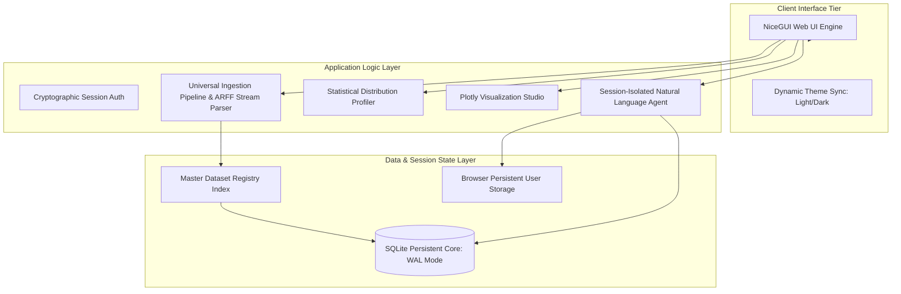

# 🛡️ FinSecure AI: Hybrid Financial Analytics & Fraud Detection

FinSecure AI is an enterprise-grade financial data parsing, intelligence, and profiling engine. Designed around a **Phased Academic Development Model**, the platform transitions data architectures across two evaluation milestones: tracking infrastructure and interactive profiling (Phase 1) into automated schema realization, session-bound context vector math, and isolated analytical sandboxes (Phase 2).

---

## 🏗️ High-Level System Architecture & Design

The ecosystem utilizes an asynchronous, non-blocking **Model-View-Controller (MVC)** framework driven by **NiceGUI** on the frontend, mapped directly to an optimized **SQLite database micro-core executing in Write-Ahead Logging (WAL) mode** for high concurrency and zero transactional deadlocks.



### Operational Lifecycle
1. **Dynamic ETL Loop:** Uploaded raw bytes streams enter a regex-based string sanitizer, mapping multi-format variables directly into dynamically realized SQLite database columns.
2. **Contextual Analysis Loop:** Natural language strings are evaluated against active session dictionaries stored inside individual browser client contexts, isolating concurrent requests across unique users.

---

## 🏁 Phase 1: Minor Project Milestone (Core Infrastructure)
*Focus: Data engineering foundations, cross-compatible ingestion mechanics, and programmatic visualization grids.*

### 🌟 Implemented Engineering Modules:
- **Universal Data Ingestion Engine:** Integrated native loading maps for structural formats including `.csv`, `.xlsx`, and `.json`.
- **Plotly Visualization Studio:** Built a dynamic rendering panel supporting interactive structural charts (`Bar`, `Scatter`, `Line`, `Area`) synchronized with user dark-mode interface parameters.
- **Cryptographic Security Vault:** Implemented multi-user application logins utilizing **SHA-256 password hashing loops** enforced with cryptographically generated unique text salts via `secrets`.
- **Administrative Table Catalog:** Implemented an index mapping table (`dataset_registry`) to actively monitor file footprints, execution stamps, row profiles, and user ownership keys.

---

## 🚀 Phase 2: Capstone Project Upgrade (Intelligent Systems & Isolation)
*Focus: Custom token-stream parsers, multi-turn stateful conversational math, and session memory fencing.*

### 🔥 Advanced Structural Upgrades:
- **Custom Robust ARFF Stream Parser:** Replaced generic text-loading modules with a custom streaming tokenizer. It separates heavy metadata attributes (`@attribute`) from raw payload instances (`@data`) using text block splitting to safely read large machine-learning benchmark streams (e.g., Weka datasets) while catching missing values (`?`, `NA`) gracefully.
- **Session-Isolated AI Copilot Engine:** Refactored the core conversational memory architecture away from static global scripts down to **isolated browser cookie state partitions (`app.storage.user`)**. This ensures strict multi-user thread safety and prevents cross-user context bleeding.
- **Multi-Turn Context Tracking & Fuzzy Matching:** Configured an evaluation threshold string loop (`difflib.get_close_matches` with `cutoff=0.4`) that resolves user typos and shorthand inputs. The system tracks column selection memory over multiple chat turns, allowing sequential commands (e.g., *"Look at withdrawals"* followed by *"What is the total sum?"* or *"Give me the average value"*) to evaluate correctly without resetting targets.
- **Cascading Registry Purges:** Embedded instantaneous database drop commands (`DROP TABLE IF EXISTS`) linked directly with master tracking registers to guarantee clean storage maintenance and compliance.

---

## 🌿 Branching Strategy

This repository segregates evaluation phases through strict, branch-based code isolation:
- **`main` Branch (Stable Production):** Houses the complete, refactored Phase 2 architecture incorporating NiceGUI async views, the custom ARFF parser, and session-bound conversation matrices.
- **`capstone-upgrade` / Legacy Branches:** Storage spaces reserved for historic experimental iterations.

---

## ⚙️ Local Setup & Execution

### 1. Install System Dependencies
Ensure your target virtual development sandbox contains the fully updated platform requirements:
```bash
pip install nicegui pandas plotly openpyxl
```

### 2. Boot the Intelligent Engine
Initialize your local web server by running the primary entry script:
```bash
python main_2.py
```
Open your browser and navigate to the security entry portal: **`http://localhost:8080/login`**
